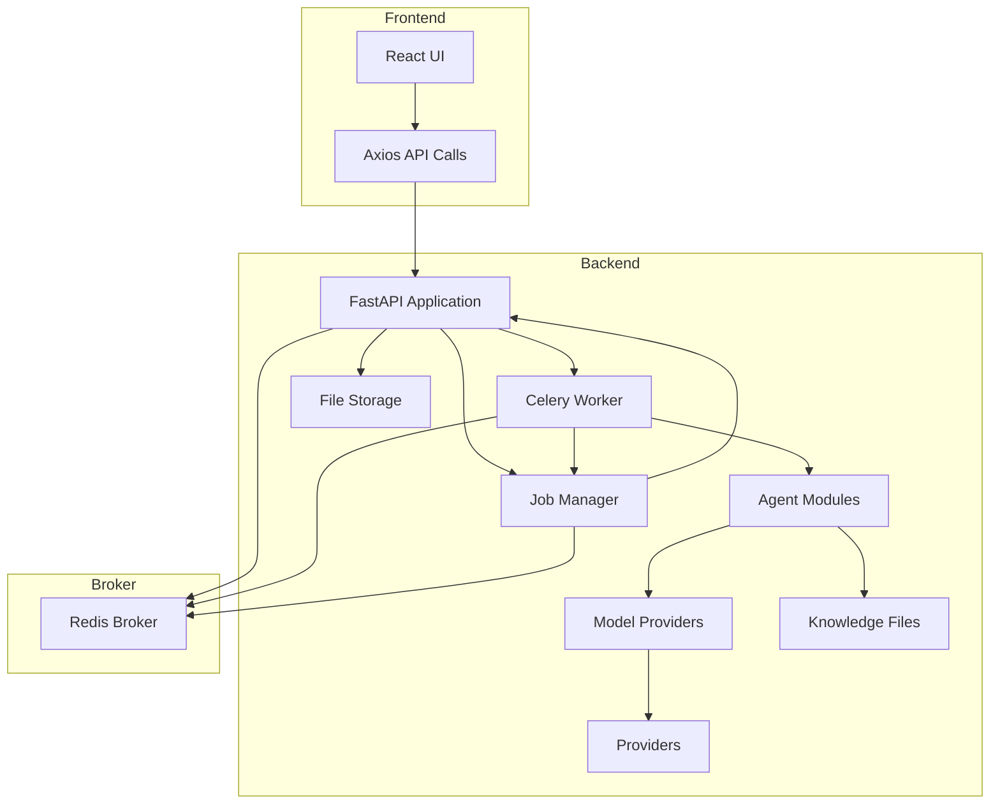
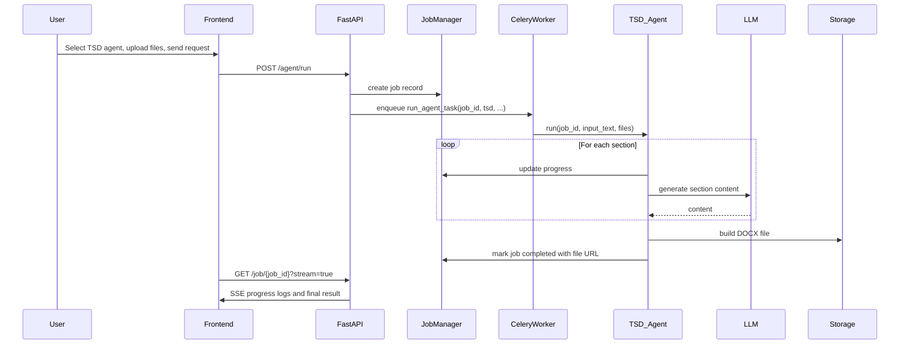

# Architecture Diagrams

Below are Mermaid diagrams that illustrate the high‑level architecture and the sequence of operations in the AI agents platform.

## Overall System

The frontend interacts with the FastAPI backend via HTTP.  Heavy tasks are queued into Celery using a Redis broker.  Agents read from their RAG folders and call the configured model providers.  Generated documents are saved to the file storage directory and served via the `/static` route.

## TSD Agent Execution Sequence

This sequence covers the asynchronous execution of the TSD agent.  The ABAP agent follows a similar pattern but returns text instead of a document.